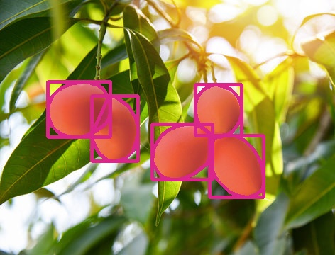
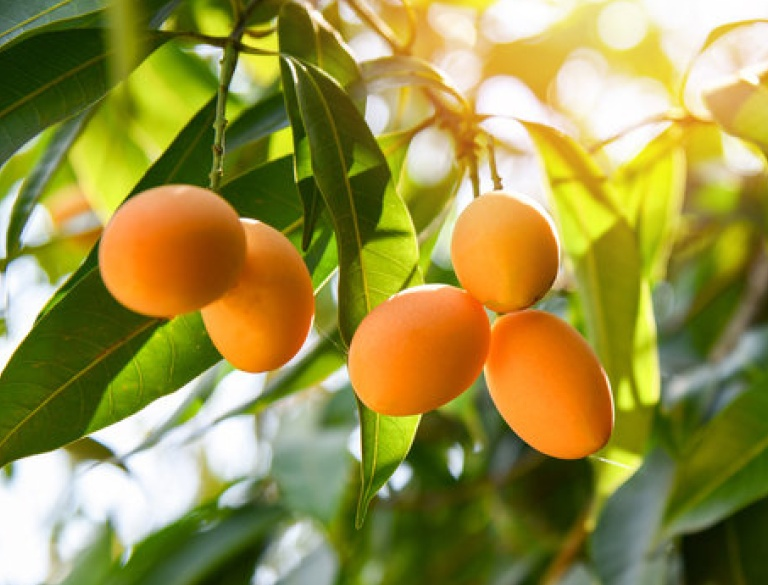

# End-to-End Example: Image + COCO Annotation Transform

This example demonstrates how CTU keeps annotations synchronized with image transformations.
We will show, side by side, the original image/annotation and the transformed image/annotation.

## Original

- Image


- COCO annotation overlaid (bbox, polyline, mask)



- Mask-only overlay


A single-image COCO slice (truncated):

```json
{
  "images": [
    {
      "file_name": "Mangoes.jpeg", "id": 0, "width": 1920, "height": 1080
    }
  ],
  "annotations": [
    { "image_id": 0, "category_id": 1, "segmentation": [[...]], "bbox": [ ... ] }
  ],
  "categories": [ {"id": 1, "name": "fruit"}, ... ]
}
```

## Transform Spec and Calls

```python
from ctu import (
    modification_spec_template,
    normalize_modification_spec,
    get_modified_image,
    get_modified_coco_annotation,
)

spec = dict(modification_spec_template)
spec.update({
    "image_path": "examples/datasets/mini/Mangoes.jpeg",
    "aspect_ratio": "maintain",
    "image_ht_wd": (600, 800),
    "padding_ht_wd": (0.10, 0.10),
    "padding_color": (10, 10, 10),
    "crop_pt1_pt2": ((0.1, 0.1), (0.9, 0.9)),
})

spec = normalize_modification_spec(spec)
img = get_modified_image(spec)
ann = get_modified_coco_annotation(img, "examples/datasets/mini/coco-annotation.json", spec)
```

## Transformed

- Transformed image



- COCO annotation overlaid (bbox, polyline, mask)


- Mask-only overlay


A snippet of the transformed COCO (truncated):

```json
{
  "images": [ { "file_name": "Mangoes.jpeg", "width": 800, "height": 600, ... } ],
  "annotations": [ { "bbox": [ ... ], "segmentation": [[ ... ]], "area": 12345 } ],
  "categories": [ ... ]
}
```
