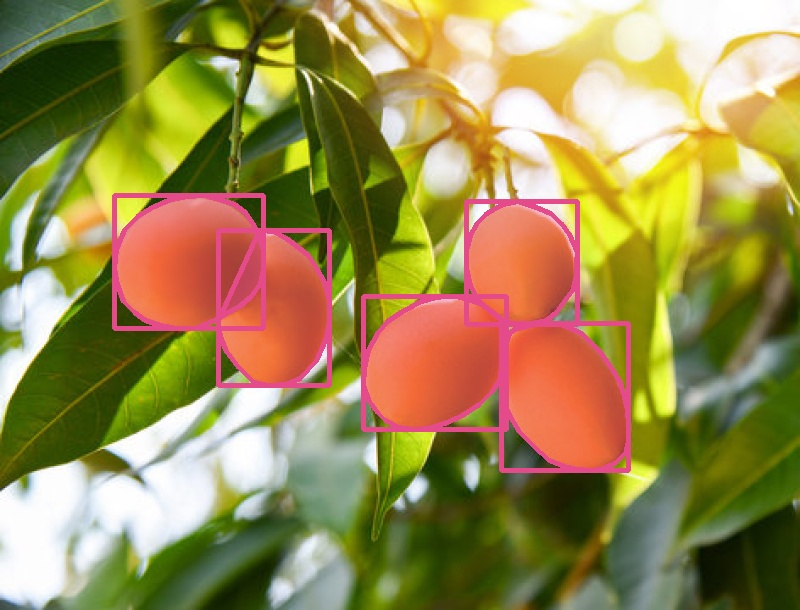
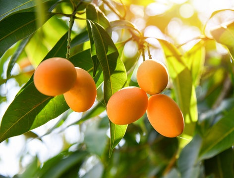
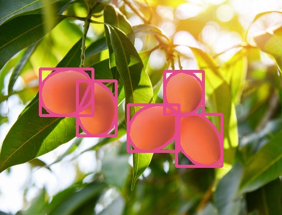
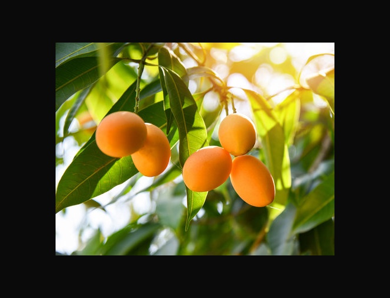
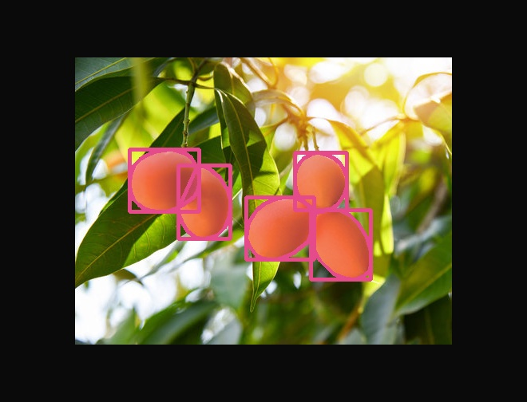
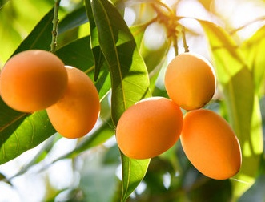
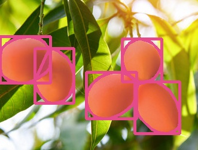

# Visual Recipes (No Code)

A few common transformation recipes with side-by-side visuals. Each shows the transformed image and the annotation overlay updated to match.

## Resize (maintain aspect ratio)

Transformed image:

Overlay (bbox+polyline+mask):

## Resize (fixed size 400x400)

Transformed image:

Overlay (bbox+polyline+mask):

## Padding only (20%)

Transformed image:

Overlay (bbox+polyline+mask):

## Crop only (15% inset)

Transformed image:

Overlay (bbox+polyline+mask):

